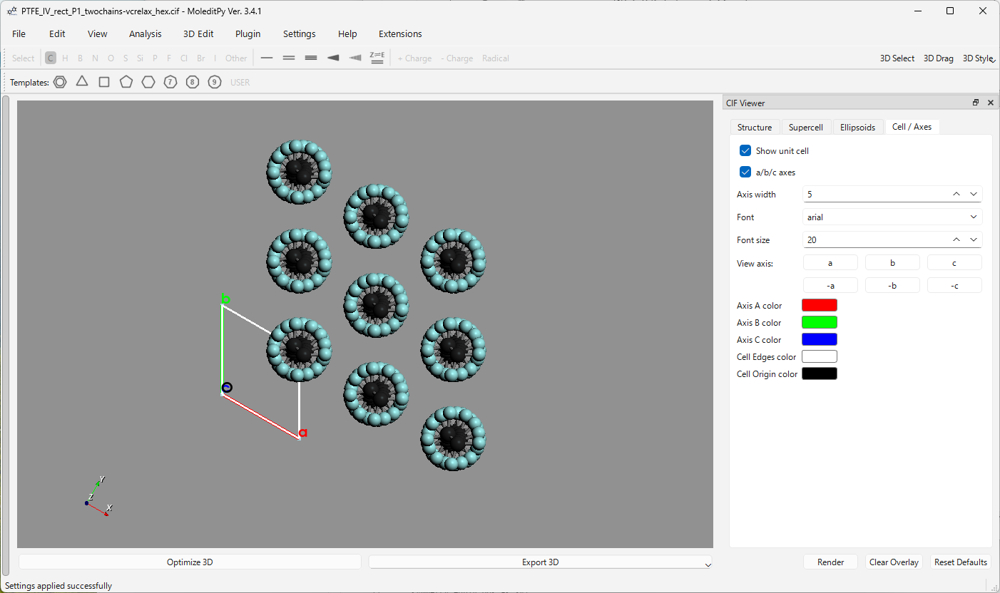

# MoleditPy CIF Viewer

A crystal structure viewer plugin for [MoleditPy](https://github.com/HiroYokoyama/python_molecular_editor). 

This plugin allows researchers and developers to load CIF files, generate supercells, customize rendering styles, view along crystallographic axes, and display anisotropic displacement parameters (Thermal Ellipsoids) with extensive styling options.


---

## Table of Contents
1. [Key Features](#key-features)
2. [Detailed Tab Guide & Settings](#detailed-tab-guide--settings)
3. [Advanced Rendering & Optimization](#advanced-rendering--optimization)
4. [Crystallographic Camera Math](#crystallographic-camera-math)
5. [Code Architecture & Integration](#code-architecture--integration)
6. [Installation](#installation)
7. [Verification & Testing](#verification--testing)
8. [Dependencies](#dependencies)

---

## Key Features

*   **High Performance Rendering**: Optimized drawing routines that merge points, ellipsoids, and line segments into single PyVista/VTK actors, eliminating $O(N)$ draw call bottlenecks.
*   **Crystallographic Camera Alignment**: Single-click camera reorientation along the fractional directions ($a$, $b$, $c$, $-a$, $-b$, $-c$) with mathematically aligned orientation up vectors.
*   **Thermal Ellipsoid ADP Visualization**: Support for rendering anisotropic displacement parameters (ADPs) at arbitrary probability levels (e.g. 50%).
*   **Supercell Construction**: Dynamic supercell generation with optional periodic boundary molecule reconstruction to prevent fragmenting molecular units.

---

## Detailed Tab Guide & Settings

The CIF Viewer control panel docks as a widget on the right side of the main window (**View > CIF Viewer Panel**). Its interface is organized into four sections:

### 1. Structure Tab
*   **File Loader**: Opens a standard file selection dialog to load a `.cif` file. Displays the current file name.
*   **Structure Selector Table**: If the loaded CIF contains multiple structures (e.g. from a file containing different phases or snapshots), a table appears allowing the user to select which structure to visualize.
*   **Summary Box**: Displays the number of atoms in the unit cell, total rendered atoms, inferred bonds, and current supercell repetition coordinates.
*   **Export CIF Button**: Saves the currently rendered supercell structure (including duplicates and connection-fixes) into a new standard CIF file.

### 2. Supercell Tab
*   **Repetitions ($a$, $b$, $c$)**: Spinboxes (range 1 to 8, default `1`) determining how many unit cells to stack along each crystallographic axis.
*   **Keep Molecules Connected Checkbox**: When checked, the generator automatically detects molecules split across unit cell boundaries and completes them. This prevents fragments from floating detached in space.
*   **Show Bonds Checkbox**: Controls whether inferred inter-atomic bonds are rendered in the 3D view.
*   **Show Hydrogen Atoms Checkbox**: Controls the rendering of hydrogen atoms (default `True`). Unchecking this filters out hydrogen atoms, significantly speeding up rendering for large organic framework structures.
*   **Reset Supercell Button**: Instantly resets the supercell back to `1 x 1 x 1`.
*   **2x2x2 & 3x3x3 Presets**: Quick-setup buttons for common supercell dimensions.

### 3. Ellipsoids Tab
*   **Show Circles Checkbox**: Toggles the rendering of the ellipsoid rings/hoops.
*   **Circle Color Button**: Open a color selection picker to change the color of the ellipsoid rings (default: `#000000`/black).
*   **Circle Width Spinbox**: Adjusts the line thickness of the rings (range 1 to 10, default `2`).
*   **Probability (%) Spinbox**: Sets the probability volume threshold for the displacement ellipsoids (range 1.0% to 99.9%, default `50.0%`).
*   **Fix Hydrogen Atom Size Checkbox**: Hydrogen atoms typically have poorly resolved or non-existent anisotropic thermal parameters. Checking this draws hydrogen atoms as fixed spheres rather than distorted ellipsoids.
*   **H Scale (% VDW) Spinbox**: Specifies the scale of fixed-size hydrogen spheres as a percentage of their van der Waals radius (range 1.0% to 100.0%, default `20.0%`).
*   **Switch to Ellipsoids Style Button**: Instantly sets the main window's active 3D visualization style to the Thermal Ellipsoids method and syncs the main toolbar menu checkmark.

### 4. Cell / Axes Tab
*   **Show Unit Cell Checkbox**: Toggles the drawing of unit-cell borders.
*   **a/b/c Axes Checkbox**: Toggles labels (`a`, `b`, `c`) and colored vectors at the origin.
*   **Axis Width Spinbox**: Sets the line width of cell axes and cell borders (range 1 to 12, default `5`).
*   **Font Selection**: Dropdown selecting the axis label font family (`arial`, `courier`, `times`).
*   **Font Size Spinbox**: Sets the font size of the axis labels (range 8 to 48, default `20`).
*   **Color Pickers**: Custom colors for:
    *   Axis A (default: Red `#ff0000`)
    *   Axis B (default: Green `#00ff00`)
    *   Axis C (default: Blue `#0000ff`)
    *   Cell Edges (default: White `#ffffff`)
    *   Origin Sphere (default: Black `#000000`)
*   **View Axis Grid**: A $2 \times 3$ grid of buttons (`a`, `b`, `c`, `-a`, `-b`, `-c`) to instantly re-orient the camera view.

---

## Advanced Rendering & Optimization

Drawing thousands of spheres and lines individually can bottleneck the CPU/GPU interface. The plugin uses several advanced strategies to maximize performance:

1.  **Single Mesh Merging**: 
    Instead of adding a PyVista actor for each ellipsoid, the plugin pre-processes the point-cloud of the atoms. For each atom, it creates a base sphere, applies the anisotropic displacement scale matrix, rotates it according to the thermal eigenvectors, translates it to the fractional position, and colors it. All individual meshes are then concatenated into a single master `pyvista.PolyData` mesh and added to the plotter in one call.
2.  **PolyData Lines Pre-Assembly**: 
    Rings representing the outer boundaries of the ellipsoids are constructed by calculating circular segments around the principal planes of the thermal ellipsoids. The points for all circles are pre-calculated, indexed, and loaded into a single polydata line mesh structure to be drawn in a single operation.
3.  **Debouncing**:
    Adjusting sliders or color pickers can trigger multiple redraw signals in milliseconds. The widget routes all redraw events through a 50ms single-shot `QTimer` (`self.render_timer`). Rapid adjustments reset the timer, ensuring a single render occurs only after the user stops interacting with the UI.

---

## Crystallographic Camera Math

Viewing along crystallographic axes requires setting the camera's position, focal point, and up vector relative to the lattice vectors. 

Let the unit cell lattice be represented by a $3 \times 3$ matrix:
$$\mathbf{L} = \begin{bmatrix} \mathbf{a} \\ \mathbf{b} \\ \mathbf{c} \end{bmatrix}$$

When a user clicks one of the directional buttons, the camera properties are calculated as follows:

| Button | View Direction ($\mathbf{d}$) | View Up Vector ($\mathbf{u}$) |
| :---: | :---: | :---: |
| **a** | $\mathbf{a}$ | $\mathbf{c}$ |
| **-a** | $-\mathbf{a}$ | $\mathbf{c}$ |
| **b** | $\mathbf{b}$ | $\mathbf{c}$ |
| **-b** | $-\mathbf{b}$ | $\mathbf{c}$ |
| **c** | $\mathbf{c}$ | $\mathbf{b}$ |
| **-c** | $-\mathbf{c}$ | $\mathbf{b}$ |

1.  **Focal Point**: The center of the current supercell, calculated using the lattice vectors scaled by their repetition bounds:
    $$\mathbf{f} = \frac{1}{2} (n_a \mathbf{a} + n_b \mathbf{b} + n_c \mathbf{c})$$
2.  **Distance**: Scaled to twice the maximum dimension of the supercell bounding box to guarantee all atoms fit in the viewport:
    $$\text{distance} = 2 \times \max(\|\mathbf{a}\| n_a, \|\mathbf{b}\| n_b, \|\mathbf{c}\| n_c)$$
3.  **Camera Position**: Positioned along the unit direction vector $\mathbf{\hat{d}}$ at the computed distance from the focal point:
    $$\mathbf{p} = \mathbf{f} + \mathbf{\hat{d}} \times \text{distance}$$
4.  **View Up**: Normalized view up vector $\mathbf{\hat{u}}$ ensuring stable crystallographic orientation.

---

## Code Architecture & Integration

The plugin uses the MoleditPy Plugin API, structured as follows:

*   **`cif_viewer/__init__.py`**: Contains the plugin metadata, the `initialize(context)` entry point, the `.cif` file opener association, and the `draw_ellipsoid_model` styling method.
*   **`cif_viewer/parser.py`**: Handles low-level CIF file reading. Attempts high-fidelity parsing via `pymatgen` if installed, falling back to a lightweight built-in string parser. Contains the supercell generator and CIF file exporter.
*   **`cif_viewer/rdkit_bridge.py`**: Maps parsed structures into an RDKit molecule. Applies a special flag `_from_cif_viewer` to the molecule properties.
*   **`cif_viewer/viewer.py`**: Manages the PySide/PyQt6 graphical controls, load/save configuration states in `settings.json`, and coordinates camera view transformations.

### Failsafe Safeguard
The custom drawing callback in `__init__.py` checks the active molecule for the `_from_cif_viewer` property. If a user loads a normal molecule (e.g. from an XYZ or MOL file) while the style is set to "Thermal Ellipsoids", the plugin automatically switches the view back to "Ball and Stick" style, preventing rendering artifacts or crash loops.

---

## Installation

### Standard Installation
Download from [Plugin Explorer](https://hiroyokoyama.github.io/moleditpy-plugins/explorer/?q=CIF+Viewer). Place the `cif_viewer` folder into your local MoleditPy plugins directory (typically under `~/.moleditpy/plugins/`).

---

## Verification & Testing

The plugin comes with a comprehensive unit and integration test suite that runs headlessly by mocking the main application context and Qt GUI loop.

```bash
# Run the full test suite
python test_all.py

# Run only unit/parser tests (skipping PyQt6 GUI/integration tests)
python test_all.py --unit-only
```

---

## Dependencies

*   **`numpy`**: High-performance linear algebra for coordinates, lattice vectors, and camera rotation matrices.
*   **`pymatgen`**: Comprehensive crystallographic parsing of CIF files, symmetry evaluation, and anisotropic displacement parameter extraction.
*   **`PyQt6`**: Dockable GUI layouts, slider widgets, color pickers, and asynchronous timers.
*   **`pyvista`**: High-level VTK wrapper for 3D rendering of structural meshes, borders, lines, and camera manipulations.
*   **`rdkit`**: Cheminformatics library for atom modeling, bond perception, and property storage.
